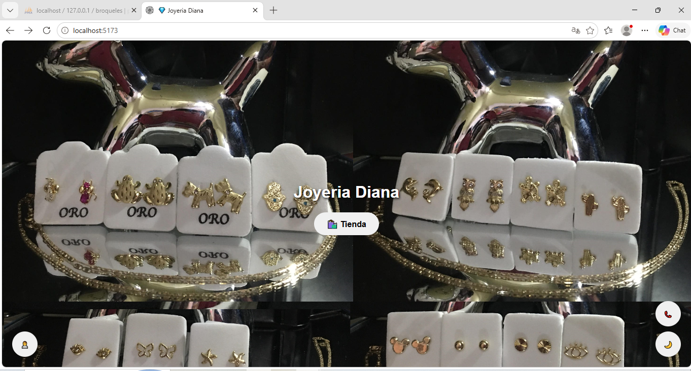
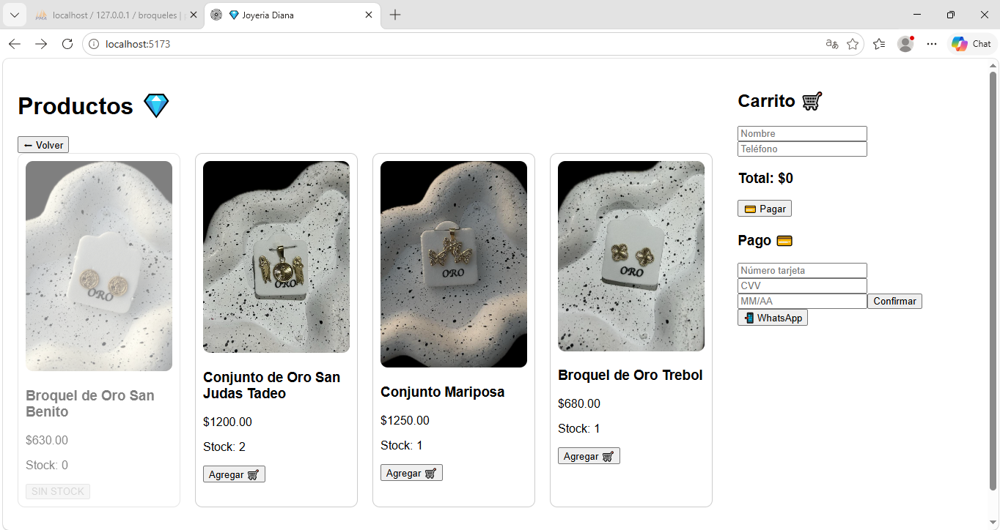
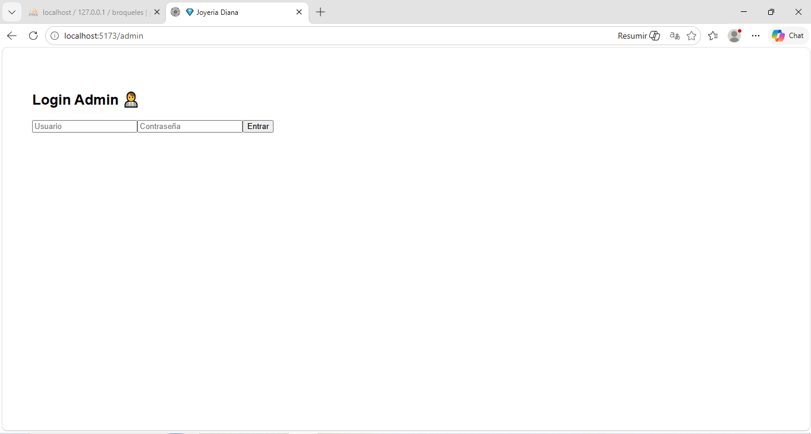
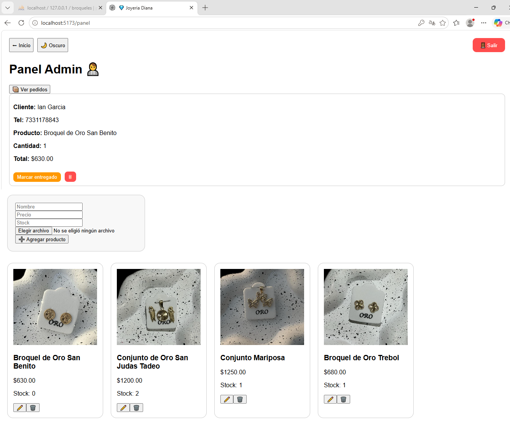

Joyeria - Ecommerce 
Descripción

Aplicación fullstack de ecommerce para venta de joyería desarrollada con React, Node.js, Express y MySQL.

Incluye:

catálogo de productos
carrito de compras
panel administrador
autenticación JWT
subida de imágenes
control de stock
pedidos
modo oscuro
integración con WhatsApp

 Tecnologías
Frontend
React
React Router
Axios
CSS
Backend
Node.js
Express
MySQL
JWT
Multer
bcryptjs

 Funcionalidades
Cliente
Ver productos
Agregar al carrito
Simular compra
Enviar pedido por WhatsApp
Dark mode
Administrador
Login seguro
Agregar productos
Editar productos
Eliminar productos
Ver pedidos
Marcar pedidos entregados

⚙️ Instalación
Frontend
cd frontend
npm install
npm run dev
Backend
cd backend
npm install
node server.js
🗄️ Base de datos

Importar la base de datos MySQL:

broqueles.sql
👨‍💻 Autor Diana Laura Pichardo García