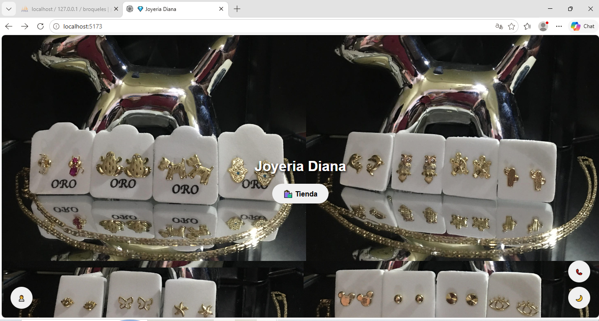
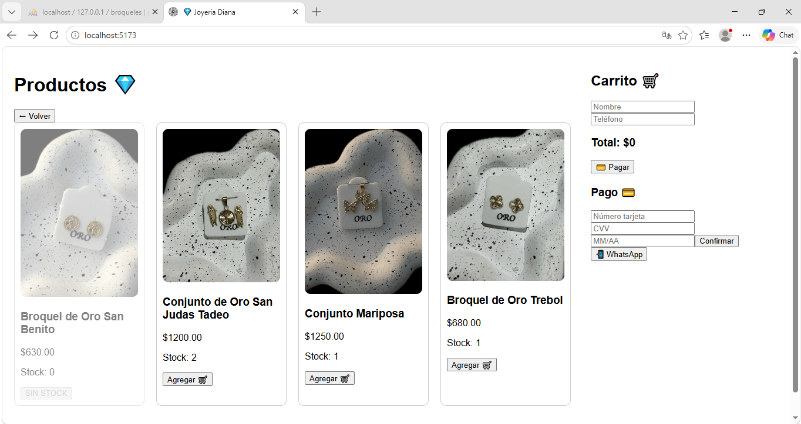
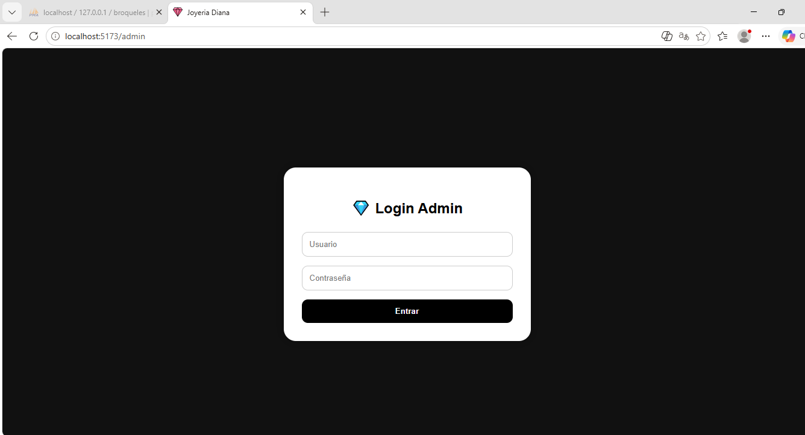
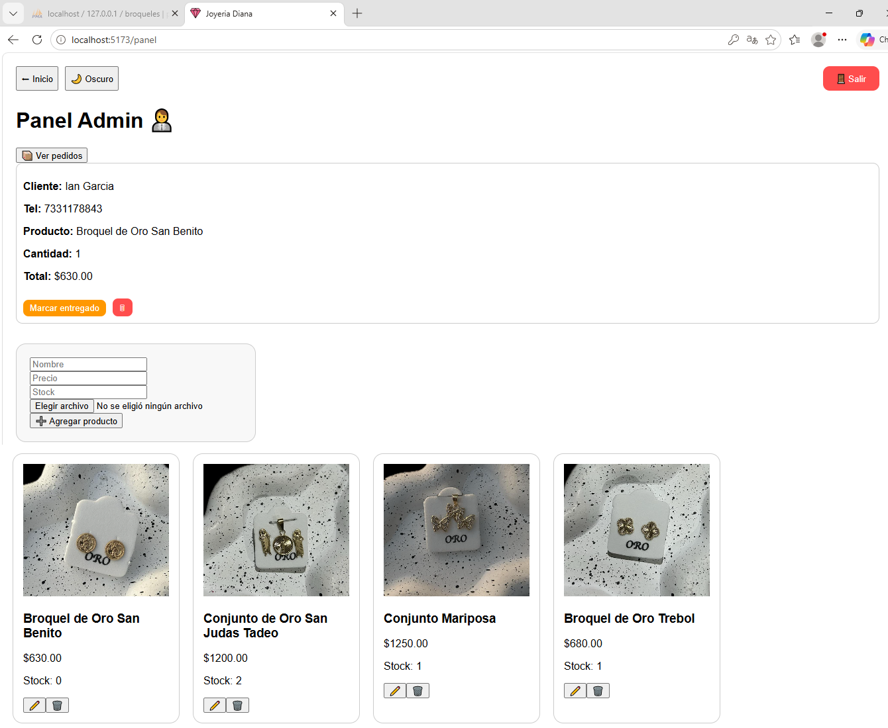

# 💎 Joyería Diana - Ecommerce Fullstack

Aplicación web fullstack para venta de joyería desarrollada con React, Node.js, Express y MySQL.

## 🚀 Demo

Frontend: https://proyecto-joyeria.vercel.app/

## ✨ Características

### Cliente

* Visualización de productos
* Carrito de compras
* Simulación de pago
* Envío de pedidos por WhatsApp
* Control de stock
* Modo oscuro
* Diseño responsive

### Administrador

* Login protegido
* Autenticación con JWT
* Crear productos
* Editar productos
* Eliminar productos
* Gestión de pedidos
* Marcar pedidos como entregados
* Subida de imágenes con Multer

---

# 🛠️ Tecnologías

## Frontend

* React
* React Router DOM
* Axios
* Vite
* CSS Inline Styles

## Backend

* Node.js
* Express
* MySQL
* JWT
* bcryptjs
* Multer
* CORS

## Deploy

* Vercel (Frontend)
* Render (Backend)

---

# 📸 Capturas

## Home



## Tienda



## Login



## Panel Admin



---

# ⚙️ Instalación local

## 1. Clonar repositorio

```bash
git clone https://github.com/DianaPichardo03/Proyecto-Joyeria.git
```

---

# 🔹 Frontend

```bash
cd frontend
npm install
npm run dev
```

---

# 🔹 Backend

```bash
cd backend
npm install
npm run dev
```

---

# 🗄️ Variables de entorno

Crear archivo `.env` en backend:

```env
DB_HOST=
DB_USER=
DB_PASSWORD=
DB_NAME=
DB_PORT=
JWT_SECRET=
```

---

# 🗄️ Base de datos

Importar:

```sql
broqueles.sql
```

---

# 📚 Lo que aprendí

* Consumo de APIs
* CRUD completo
* Manejo de estados en React
* Autenticación JWT
* Upload de imágenes
* Deploy fullstack
* Manejo de rutas protegidas
* Conexión frontend/backend
* Persistencia de datos con MySQL

---

# 👩‍💻 Autor

ISC. Diana Laura Pichardo García

GitHub:
https://github.com/DianaPichardo03
